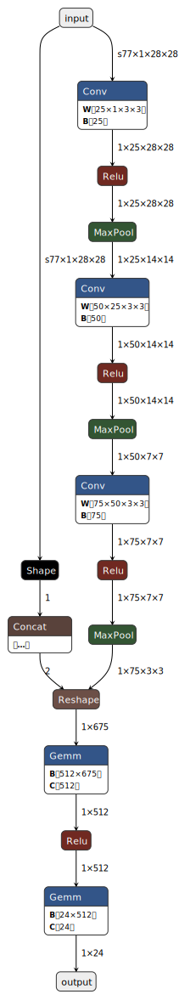

# 🕵️‍♂️ PoC : Attaque Backdoor sur Sign Language MNIST

Ce projet montre une preuve de concept d'attaque par empoisonnement (BadNets) sur un classifieur de langage des signes. L'objectif est de conserver une bonne précision sur des images propres tout en forçant une prédiction choisie dès qu'un patch déclencheur est présent.


## 🎯 Objectifs

- Furtivité : précision élevée sur les images propres.
- Efficacité : taux de succès proche de 100 % quand le patch est présent.

## 🧠 Détails de l'attaque

- Type : Dirty Label / BadNets.
- Données : Sign Language MNIST (24 classes, J et Z exclus) — source Kaggle : https://www.kaggle.com/datasets/datamunge/sign-language-mnist.
- Patch : carré 5x5 en haut à gauche, valeur 1.0.
- Cible : classe 15 (remappée).
- Taux d'empoisonnement : 5 % des images d'entraînement.

## 📂 Structure

```text
POC/
 ┣ data/
 ┃ ┣ sign_mnist_train.csv
 ┃ ┗ sign_mnist_test.csv
 ┣ POC.py
 ┗ README.md
```

## ⚙️ Installation

1) Prérequis : Python 3.10+, drivers NVIDIA récents si GPU.
2) Environnement virtuel :

```powershell
python -m venv .venv
.\.venv\Scripts\Activate
```

3) Dépendances :

```powershell
# PyTorch (ajustez la version CUDA au besoin)
pip install torch torchvision --index-url https://download.pytorch.org/whl/cu121

# Librairies communes
pip install pandas numpy matplotlib
```

## 🚀 Utilisation

1) Placez `sign_mnist_train.csv` et `sign_mnist_test.csv` dans `data/` (ou `data/asl_data/`).
2) Lancez l'entraînement et l'attaque :

```powershell
python POC.py
```

Le script :
- charge et remappe les labels (suppression du trou J=9) ;
- entraîne un modèle propre ;
- entraîne un modèle infecté avec 5 % d'images patchées ;
- calcule la clean accuracy et l'Attack Success Rate ;
- affiche quelques exemples patchés pour vérifier le trigger.

## 📊 Résultats attendus

- Clean Accuracy (furtivité) : > 90 % si l'entraînement converge correctement.
- Attack Success Rate (efficacité) : souvent proche de 100 % lorsque le patch est visible.

Illustration : exemples infectés (validation)


## 🛠️ Notes techniques

- Modèle : CNN avec 3 blocs conv + BatchNorm + Dropout, puis deux couches denses.
- Spécificités Windows/CUDA : `drop_last=True` pour la stabilité des batchs, pas de `torch.compile`.
- Remapping labels : les labels > 9 sont décalés de -1 pour avoir 24 classes continues (0-23).

Illustration du modèle (vue verticale ONNX)



## ⚠️ Avertissement éthique

Projet fourni uniquement à des fins éducatives et de recherche. Toute utilisation offensive ou non autorisée est illégale et non encouragée.